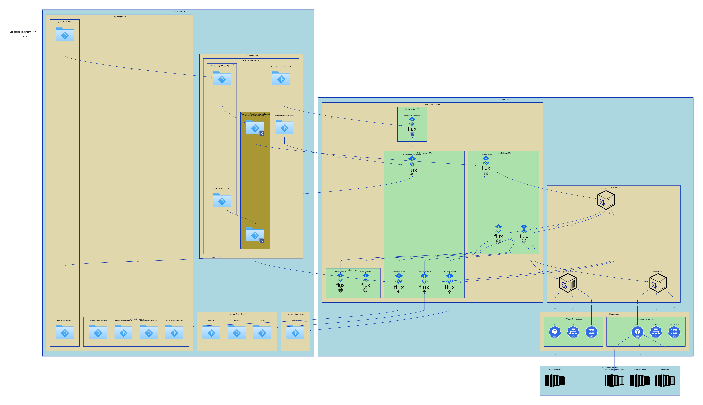

# app-arch-bigbang-architecture-diagrams

This directory contains architecture diagrams written in [d2](https://github.com/terrastruct/d2) (see details below on how to edit).

These diagrams can loosely be considered application architecture diagrams.

## diagram
[Big Bang Overview Description](./DESCRIPTION.md)


## how to modify

* get d2 cli
* run the following command while editing for diagram preview

```sh
d2 --watch bigbang.d2 bigbang.svg
```

## how to export resulting diagram

```sh
d2 bigbang.d2 bigbang.png
d2 bigbang.d2 bigbang.svg
```
