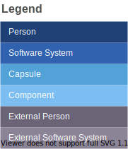
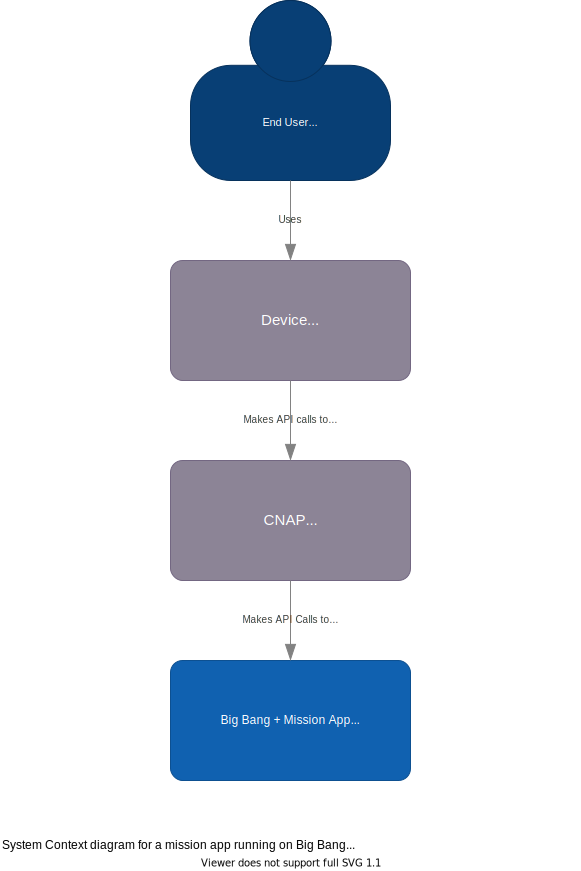

# c4-bigbang-architecture-diagrams

This directory contains architecture diagrams saved as editable SVG files that can be opened and edited on [app.diagrams.net](https://app.diagrams.net). 

These diagrams use the [C4 Model](https://c4model.com/), where system **C**ontexts are broken down into **C**apsules, which are broken down into **C**omponents, which are broken down into **C**ode

&nbsp;

## Context Diagram - Mission app running on Big Bang (with CNAP)

## Capsule Diagram - Mission app running on Big Bang (with CNAP)

## Capsule Diagram - CNAP

